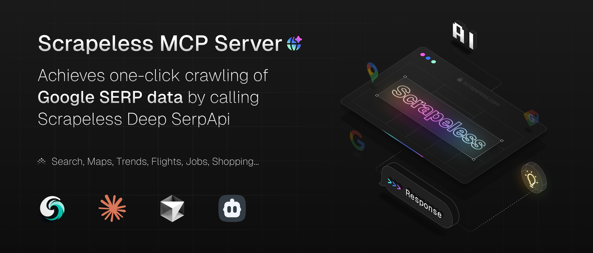

# Scrapeless Mcp Server

Model Context Protocol (MCP) is an open protocol that enables seamless integration between LLM applications and external data sources and tools. MCP provides a standardized way to connect LLM with the required context, helping you efficiently enhance chat interfaces, build AI-driven IDEs, or create custom AI workflows.

Seamlessly integrate real-time Google SERP(Google Search, Google Flight, Google Map, Google Jobs....) results into your LLM applications using the Scrapeless MCP server. This server acts as a bridge between LLMs (like ChatGPT, Claude, etc.) and Scrapeless's Google SERP, enabling dynamic context retrieval for AI workflows, chatbots, and research tools.

👉 Live MCP Endpoint: 
- [mcp.so](https://mcp.so/server/scrapelessMcpServer/scrapeless-ai)
- [glama.ai](https://glama.ai/mcp/servers/@scrapeless-ai/scrapeless-mcp-server)

📦 NPM Package: [scrapeless-mcp-server](https://www.npmjs.com/package/scrapeless-mcp-server)

## Overview

This project provides several MCP servers that enable AI assistants like Claude to perform various search operations and retrieve data from:

- Google Search

## Tools

### 1. Search Tool
- Name: `google-search`
- Description: Search the web using Scrapeless
- Parameters:
    * `query` (required): Parameter defines the query you want to search. You can use anything that you would use in a regular Google search. e.g. inurl:, site:, intitle:.
    * `gl` (optional, default: "us"): Parameter defines the country to use for the Google search. It's a two-letter country code. (e.g., us for the United States, uk for United Kingdom, or fr for France).
    * `hl` (optional, default: "en"): Parameter defines the language to use for the Google search. It's a two-letter language code. (e.g., en for English, es for Spanish, or fr for French).


## Setup Guide

### 1. Get Scrapeless Key
1. Register at [Scrapeless](https://app.scrapeless.com/passport/register?utm_source=github&utm_medium=mcp)
2. [Get your free trial](https://app.scrapeless.com/landing/guide?utm_source=github&utm_medium=mcp)
3. [Generate API Key](https://app.scrapeless.com/dashboard/settings/api-key?utm_source=github&utm_medium=mcp)


### 2. Configure

```json
{
  "mcpServers": {
    "ScrapelessMcpServer": {
      "command": "npx",
      "args": ["-y", "scrapeless-mcp-server"],
      "env": {
        "SCRAPELESS_KEY": "YOUR_SCRAPELESS_KEY"
      }
    }
  }
}
```


## Example Queries

Here are some examples of how to use these servers with Claude Desktop:

### Google Search
```
Please search for "climate change solutions" and summarize the top results.
```


## Installation

### Prerequisites

- Node.js 22 or higher
- NPM or Yarn

### Install from Source

1. Clone the repository:
```bash
git clone https://github.com/scrapeless-ai/scrapeless-mcp-server.git
cd scrapeless-mcp-server
```

2. Install dependencies:
```bash
npm install
```


3. Build the server:
```bash
npm run build
```


## Community
- [MCP Server Discord](https://backend.scrapeless.com/app/api/v1/public/links/discord)
